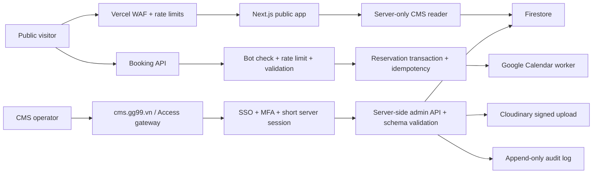

# GG99 Security Assessment & Hardening Plan

**Ngay danh gia:** 2026-07-10

**Pham vi:** `https://www.gg99.vn`, CMS `/admin`, Firebase Auth/Firestore, Cloudinary, Google Calendar booking, Vercel, source code va CI/CD local

**Phuong phap:** external attacker review + source-assisted review, chi dung cac phep thu khong pha hoai
**Trang thai:** Bao cao va ke hoach de duyet, chua trien khai hardening

> Luu y: Bao cao khong ghi lai mat khau, Firebase token, API key, private key, Cloudinary preset name hoac secret. Khong brute-force, khong upload file, khong tao booking, khong sua Firestore va khong gay tai tren production.

## 1. Executive summary

Live site dang co nen tang ha tang kha on: HTTPS redirect hoat dong, HSTS da bat, cac API admin tu choi request khong co token, revalidate secret dang duoc cau hinh, file `.env` khong bi commit va Vercel deployment hien tai o trang thai Ready.

Rui ro lon nhat nam o lop quan tri va cac API co chi phi ngoai:

| Muc | Finding | Trang thai | Tac dong chinh |
|---|---|---|---|
| Critical | Tai khoan admin dung credential do phuc tap thap, chua co luong MFA trong code | Can xu ly ngay | Chiem CMS, sua noi dung, lay quyen Firestore va upload |
| High | Cloudinary unsigned upload preset duoc embed trong public bundle | Da xac minh preset nhan request khong can chu ky; khong upload asset | Spam storage/bandwidth, asset doc hai duoi tai khoan thuong hieu |
| High | `/api/book` va `/api/availability` khong co rate limit/CAPTCHA/cache chong abuse | Xac minh tu code va live | Spam Calendar, quota/cost exhaustion, double booking, do lich ban |
| High | Firestore CMS cho phep public read toan bo document | Live REST tra `200` khong can auth | Lo draft, metric chua cong bo, noi dung an va cau truc CMS |
| High | CMS co the bi iframe; nut seed la thao tac mot click khong confirm | Header chong frame dang thieu | Clickjacking gay reset/ghi de noi dung |
| High | JSON-LD serialize du lieu CMS bang `JSON.stringify` vao `dangerouslySetInnerHTML` | Da xac minh trong code | Stored XSS sau khi attacker co quyen ghi CMS |
| Medium | Thieu CSP va phan lon security headers | Live chi co HSTS | Tang kha nang XSS, clickjacking, data exfiltration |
| Medium | Public revalidate route fail-open neu secret bi thieu | Live hien 401, nhung code co fallback mo | Cache invalidation abuse khi deploy sai env |
| Medium | CMS write truc tiep tu browser, khong audit trail va schema server-side | Da xac minh | Kho truy vet, rollback va chan payload bat thuong |
| Medium | 11 dependency alerts trong production tree | 0 critical, 0 high, 9 moderate, 2 low | Supply-chain/DoS/XSS co dieu kien; can update va regression test |
| Medium | Site phuc vu tren nhieu production hostname | `www.theone.marketing` van tra 200 | Tang attack surface, duplicate origin va kha nang bypass rule theo host |
| Low | Chua co `/.well-known/security.txt` | Live 404 | Khong co kenh bao cao lo hong chinh thuc |

**Danh gia chung:** muc do rui ro hien tai la **High**. Credential admin va unsigned Cloudinary preset la hai viec can khoa truoc. Booking/availability la diem de bi competitor hoac bot abuse nhat ma khong can dang nhap.

## 2. Kien truc muc tieu

Nguyen tac muc tieu:

- Public browser khong doc/ghi Firestore truc tiep.
- CMS khong dua admin authorization vao email public hoac UI client.
- Moi thay doi noi dung di qua server, co validation, actor, timestamp va before/after.
- Moi API co chi phi ngoai phai co rate limit, timeout, circuit breaker va monitoring.
- Upload production chi dung signed upload.
- Secret dai han duoc thay bang identity federation neu dich vu ho tro.

## 3. Positive controls da xac minh

- `http://www.gg99.vn` redirect sang HTTPS.
- HSTS live: `max-age=63072000`.
- `/api/revalidate` tra `401` khi khong co secret dung.
- `/api/admin/revalidate` va `/api/admin/upload` tra `401` khi khong co Firebase token.
- `.env`, `.env.local`, Firebase service account JSON, backups va `.vercel` dang nam trong `.gitignore`.
- Scan lich su Git khong thay private-key marker hoac file `.env.local` tung duoc commit.
- `npm audit --omit=dev`: khong co finding high/critical.
- Da co local Firestore backup gan nhat; Vercel production deployment Ready.
- Vercel platform co DDoS mitigation mac dinh; can bo sung app/WAF rate limit cho API dat tien.

## 4. Attacker-view plan

Day la mo hinh duong tan cong de duyet. Neu thuc hien red-team that, tat ca brute-force, load test, upload, content injection va booking can chay tren staging/canary, khong chay tren production.

### A1 - OSINT va attack-surface mapping

**Muc tieu:** xac dinh framework, hosting, domain, API, admin identifier va third-party providers.

**Quy trinh attacker:**

1. Doc headers, DNS, robots, sitemap va public JavaScript.
2. Tim `/admin`, Firebase project config, Cloudinary cloud/preset, booking routes va alternate domains.
3. Doc public GitHub repository de map collection, rules, env names va deploy flow.
4. Lap danh sach endpoint co chi phi: Calendar read/write, Cloudinary upload, revalidate, Firestore.

**Ket qua hien tai:** Next.js/Vercel, Firebase, Cloudinary va Google Calendar deu co the fingerprint; admin identifier xuat hien trong public client bundle.

### A2 - Account takeover CMS

**Muc tieu:** lay Firebase ID token cua admin.

**Quy trinh attacker:**

1. Dung admin identifier public cho credential stuffing/password spray.
2. Loi dung credential yeu, credential tung bi chia se hoac session dai han.
3. Neu dang nhap thanh cong, Firestore rules cap write theo email va client co the ghi toan bo CMS.
4. Tao persistence bang stored XSS hoac sua link/media de dua visitor den ha tang cua attacker.

**Rui ro:** Critical until credential rotation va MFA duoc xac minh.

**Safe red-team test:** mot tai khoan canary tren staging; gioi han 5 lan dang nhap; khong spray production.

### A3 - Cloudinary resource abuse

**Muc tieu:** dung Cloudinary account cua GG99 de luu asset khong duoc phep va tieu ton quota.

**Quy trinh attacker:**

1. Lay cloud name va unsigned preset tu public CMS bundle.
2. Goi truc tiep Cloudinary upload API, bo qua Firebase token check nam trong JavaScript.
3. Lap upload de tieu ton storage, transformation va bandwidth; chen tag/folder neu preset cho phep.

**Bang chung:** preset live da nhan request unsigned den buoc yeu cau file. Audit khong upload file.

**Safe red-team test:** preset rieng trong Cloudinary test account, mot canary image nho, xoa sau khi do.

### A4 - Booking spam, quota exhaustion va schedule inference

**Muc tieu:** lam day Calendar, lam sai lead pipeline hoac tieu ton Google/Vercel quota.

**Quy trinh attacker:**

1. Enumerate availability theo nhieu ngay va nhieu `visitorId`.
2. So sanh ket qua de tach fake-busy thay doi theo visitor khoi real-busy on dinh.
3. Gui concurrent booking vao cac slot de khai thac check-then-insert race.
4. Gui body dai/khong hop le de tang log volume va external API calls.
5. Lap request availability vi moi request live dang co the goi Google Calendar.

**Tac dong:** spam event, double booking, lo pattern lich ban, quota exhaustion va false-success cho lead.

**Safe red-team test:** Calendar sandbox + synthetic load 1/10 production limit; khong gui valid booking production.

### A5 - Public Firestore harvesting

**Muc tieu:** lay du lieu CMS khong hien tren website.

**Quy trinh attacker:**

1. Dung Firebase config public goi Firestore REST/SDK khong auth.
2. Enumerate `sitePages`, `insights`, `siteSettings`.
3. So sanh status/hidden fields de lay draft, metrics chua cong bo, future campaign va internal URL.

**Bang chung:** unauthenticated read den `sitePages/homepage` live tra `200`.

### A6 - Clickjacking CMS

**Muc tieu:** lam admin dang dang nhap bam vao thao tac nguy hiem.

**Quy trinh attacker:**

1. Nhung `/admin` trong iframe trong suot tren mot trang moi.
2. Can chinh nut moi voi vi tri `Seed lai noi dung mac dinh` hoac thao tac save/delete.
3. Dan admin bam vao giao dien gia.

**Dieu kien hien tai:** khong co CSP `frame-ancestors` va khong co `X-Frame-Options`; seed la mot click, khong confirm.

### A7 - Stored XSS qua CMS/JSON-LD

**Muc tieu:** chay JavaScript tren origin `www.gg99.vn`.

**Quy trinh attacker:**

1. Sau khi co quyen CMS, chen chuoi dong `script` vao FAQ/title/schema-backed field.
2. `JSON.stringify` khong escape ky tu `<`; `dangerouslySetInnerHTML` dua chuoi vao JSON-LD script.
3. Khi admin/visitor mo page, payload co the chay tren origin site.

**Tac dong:** persistence, defacement, token theft cua admin dang mo public site, redirect/phishing visitor.

**Safe red-team test:** unit test serializer va staging CSP report-only; khong inject production.

### A8 - Revalidate va expensive API misconfiguration

**Muc tieu:** tao load/cache churn khi env bi deploy thieu.

**Quy trinh attacker:**

1. Probe `/api/revalidate` sau moi deployment/preview.
2. Neu `REVALIDATE_SECRET` bi thieu, code hien tai chap nhan request thay vi fail-closed.
3. Goi path/tag lap lai de tao regeneration load.

**Trang thai live:** dang an toan (`401`), nhung implementation can sua de tranh regression.

### A9 - Supply-chain va deployment takeover

**Muc tieu:** dua code doc hai len production thay vi tan cong runtime.

**Quy trinh attacker:**

1. Chiem GitHub/Vercel account hoac PAT/session khong MFA.
2. Loi dung main branch neu khong protected hoac CI action dung mutable tag.
3. Sua dependency/Action va cho auto-deploy len Vercel.
4. Lay environment secrets tai build/runtime neu quyen Vercel qua rong.

**Bang chung:** workflow dung `actions/checkout@v4`, `actions/setup-node@v4`, chua khai bao `permissions`; branch-protection chua xac minh duoc tu local.

## 5. Defense plan theo uu tien

### P0 - Trong 24 gio

| ID | Checklist | Owner | Acceptance criteria |
|---|---|---|---|
| P0-01 | Doi admin password thanh random 20+ ky tu, khong tai su dung | Account owner | Password cu bi vo hieu; password manager luu credential moi |
| P0-02 | Revoke toan bo Firebase admin sessions/refresh tokens | Firebase owner | Tat ca browser cu phai dang nhap lai |
| P0-03 | Bat MFA cho admin; uu tien Google Workspace SSO + passkey/TOTP | Firebase/Workspace owner | Login moi bat buoc factor thu hai; co break-glass account rieng |
| P0-04 | Tat/xoa unsigned Cloudinary preset live va remove `NEXT_PUBLIC_CLOUDINARY_UPLOAD_PRESET` | Cloudinary/Vercel owner | Public no-file probe bao preset invalid; CMS van upload qua signed API |
| P0-05 | Audit Cloudinary assets tao trong 7-14 ngay, xoa asset la, dat usage alert | Cloudinary owner | Co report theo created_at/tag/folder; alert storage/bandwidth bat |
| P0-06 | Them Vercel WAF rate limit cho `/api/book` va `/api/availability` | Vercel owner | Request vuot nguong tra 429; request hop le khong bi anh huong |
| P0-07 | Them `frame-ancestors 'none'`/`X-Frame-Options: DENY` cho `/admin` | Dev | PoC iframe khong render CMS |
| P0-08 | Bo nut seed khoi production hoac bat re-auth + go cum tu xac nhan + backup | Dev/CMS owner | Khong the seed bang mot click; co backup ID truoc thao tac |
| P0-09 | Sua `/api/revalidate` fail-closed khi secret thieu | Dev | Missing secret tra 503; wrong/missing secret tra 401 |
| P0-10 | Tao snapshot Firestore truoc hardening va luu ngoai may dev | DevOps | Backup co checksum, retention va restore instructions |

**Rate-limit khoi diem de monitor 24-48h:**

| Endpoint | Khoi diem | Key | Action |
|---|---:|---|---|
| `POST /api/book` | 3 request / gio, 8 / ngay | IP + JA4; app them email/phone hash | Challenge, sau do 429 |
| `GET /api/availability` | 30 request / phut, 300 / ngay | IP + JA4 | 429 va cache response |
| `/api/admin/*` | 20 request / phut | IP + uid | 429 + alert sau nhieu 401/403 |
| `POST /api/revalidate` | 10 request / phut | IP | 429 |

Nguyen tac: bat mode `Log` truoc, xem false-positive, sau do publish `Deny/Challenge`.

### P1 - Trong 7 ngay

#### Authentication va CMS authorization

- [ ] Chuyen admin authorization tu email string sang Firebase custom claim `role=admin`/`role=superadmin`.
- [ ] Bat buoc `email_verified == true`; disable public sign-up va provider khong dung.
- [ ] Tach CMS sang `cms.gg99.vn` hoac Access gateway; chi cho Workspace identities duoc phep.
- [ ] Exchange Firebase ID token thanh server session cookie `HttpOnly; Secure; SameSite=Strict`.
- [ ] Gioi han session admin 4-8 gio; re-auth cho seed/delete/publish/settings.
- [ ] Khong embed `NEXT_PUBLIC_ADMIN_EMAILS`; admin route khong tiet lo allowlist.
- [ ] Them hai role: editor va superadmin; editor khong duoc seed, xoa page, sua auth/settings.

#### Firestore va CMS data path

- [ ] Doi Firestore public read thanh admin-only vi public pages da doc qua server repository.
- [ ] Moi write CMS di qua server API; client khong `setDoc` truc tiep.
- [ ] Validate payload bang schema: enum, max length, allowed keys, document size, URL protocol/domain.
- [ ] Rules check custom claim va schema co ban; them Firebase Rules Emulator tests.
- [ ] Them append-only `cmsAuditLogs`: actor uid, action, doc, before hash, after hash, timestamp, request ID.
- [ ] Them content revision history va nut rollback tung document.
- [ ] Tinh nang publish phai phan biet draft va published; public server chi doc published projection.

#### Booking va Calendar

- [ ] Verify Cloudflare Turnstile hoac reCAPTCHA Enterprise token o server truoc Calendar call.
- [ ] Validate date that, trong 0-90 ngay, khong Chu nhat; `timeFrame` bat buoc nam trong allowlist.
- [ ] Gioi han: name 80, phone 30, email 254, company 120, need 120, note 1000 ky tu.
- [ ] Normalize Unicode, trim, reject control characters/CRLF va body vuot qua kich thuoc cho phep.
- [ ] Them idempotency key; cung mot form/request khong tao hai event.
- [ ] Dung Firestore transaction/reservation lock TTL de tranh check-then-insert race.
- [ ] Cache availability 30-60 giay theo ngay/tuan; mot request khong luon goi Google API.
- [ ] Bo `visitorId` do client tu chon khoi fake-busy algorithm; khong de multi-ID inference.
- [ ] Khi Calendar loi, tra 502/503 va thong bao thu lai; khong tra success gia.
- [ ] Khong log name/phone/email/note; log request ID va hash da salt neu can chong duplicate.
- [ ] Them consent checkbox + link privacy policy + thoi han xoa lead data.

#### Upload/media

- [ ] CMS chi goi `/api/admin/upload`; tat toan bo client unsigned upload code path.
- [ ] Signed Cloudinary preset gioi han `jpg,jpeg,png,webp,avif,mp4,webm`; khong cho SVG/mac dinh raw.
- [ ] Verify magic bytes/decoder, khong tin `file.type` cua browser.
- [ ] Gioi han pixel count, video duration, file size; strip EXIF/metadata.
- [ ] Folder allowlist, random server public ID, `overwrite=false`, timeout va abort controller.
- [ ] Log actor uid, size, format, public_id va ket qua moderation.
- [ ] Quota/usage alert va quy trinh quarantine/xoa asset la.

#### XSS va security headers

- [ ] Tao `safeJsonLdStringify`: escape `<`, `>`, `&`, U+2028 va U+2029.
- [ ] Unit test payload `</script>` cho FAQ, insight title va metadata.
- [ ] Bat CSP `Report-Only`, thu report 3-7 ngay, sau do enforce.
- [ ] CSP toi thieu: `default-src 'self'`, `object-src 'none'`, `base-uri 'self'`, `form-action 'self'`, `frame-ancestors 'none'`.
- [ ] Allowlist rieng Google Fonts, Cloudinary, Firebase/Google Auth, flag CDN va media can thiet.
- [ ] Them `X-Content-Type-Options: nosniff`.
- [ ] Them `Referrer-Policy: strict-origin-when-cross-origin`.
- [ ] Them `Permissions-Policy: camera=(), microphone=(), geolocation=()`.
- [ ] Them `Cross-Origin-Opener-Policy: same-origin-allow-popups` de khong pha Google login popup.
- [ ] Tat `X-Powered-By`.
- [ ] Chi them HSTS `includeSubDomains; preload` sau khi inventory tat ca subdomain deu HTTPS.

### P2 - Trong 30 ngay

#### Secrets va IAM

- [ ] Rotate Firebase admin key, Google Calendar key, Cloudinary API secret va revalidate secret theo dot hardening.
- [ ] Tach service account CMS va Calendar; moi account chi co quyen toi thieu.
- [ ] Thay private key dai han bang Vercel OIDC/Google Workload Identity Federation neu kha thi.
- [ ] Bat MFA/passkey cho GitHub, Vercel, Google Workspace, Firebase/GCP va Cloudinary.
- [ ] Review Vercel team members/integrations; xoa account va token khong con dung.
- [ ] Khong pull production secret ve may ca nhan neu khong can; dinh ky scan local synced folders.

#### CI/CD va supply chain

- [ ] Protect `main`: PR required, 1 review, required CI, no force push, no direct push.
- [ ] Workflow dat `permissions: contents: read`.
- [ ] Pin GitHub Actions bang full commit SHA, khong chi `@v4`.
- [ ] Them Dependabot/Renovate va dependency-review cho PR.
- [ ] Them CodeQL, secret scanning/gitleaks va `npm audit --omit=dev` gate.
- [ ] Upgrade `react-router-dom` len ban patched; update transitive `qs`, `uuid`, Firebase/Google libs theo compatibility test.
- [ ] Theo doi Next.js fix cho bundled PostCSS; finding nay can user-supplied CSS/plugin malicious de exploit trong app hien tai, nen khong phai P0.
- [ ] Preview deployment khong duoc dung production secrets/data; production deploy co approval.

#### Domain va network posture

- [ ] Chon canonical host; redirect moi public alias khong can thiet ve `https://www.gg99.vn`.
- [ ] Bao ve hoac vo hieu CMS tren alternate domains.
- [ ] Inventory subdomains, DNS records va dangling CNAME moi thang.
- [ ] Duy tri Vercel DDoS protection; them WAF custom rule cho API paths.
- [ ] Tao `/.well-known/security.txt` voi contact, policy, expiry va disclosure channel.

#### Logging, alerting va recovery

- [ ] Centralize Vercel function logs va Firebase/Cloudinary audit logs.
- [ ] Alert: 401/403 spike, booking burst, availability burst, Firestore write, Cloudinary upload volume, Calendar quota/5xx.
- [ ] Redact PII va secrets tai logger; retention theo muc dich.
- [ ] Daily automated Firestore export vao bucket khac account/project, versioning va retention lock.
- [ ] Ma hoa backup; local OneDrive backup chi la ban phu, khong phai disaster-recovery source duy nhat.
- [ ] Monthly restore drill; ghi RPO/RTO va checksum.
- [ ] Vercel rollback runbook va Firestore content rollback runbook.

### P3 - Van hanh dinh ky

- [ ] Hang tuan: review alert, failed admin logins, Cloudinary usage, Calendar quota.
- [ ] Hang thang: dependency update, secret scan, DNS/subdomain review, inactive users.
- [ ] Hang quy: staging penetration test, restore drill, admin access recertification.
- [ ] Moi 6 thang: rotate non-federated secrets va review IAM.
- [ ] Hang nam: incident-response tabletop va external penetration test co scope/authorization.

## 6. Acceptance test matrix

| Test ID | Kich ban | Ket qua bat buoc |
|---|---|---|
| SEC-AUTH-01 | Login bang password cu | That bai |
| SEC-AUTH-02 | Login dung password, thieu MFA | Khong vao CMS |
| SEC-AUTH-03 | User Firebase khong co claim admin | Firestore/API 403 |
| SEC-FS-01 | REST read `sitePages` khong auth | 403 |
| SEC-FS-02 | Admin write field khong nam trong schema | 400/403 |
| SEC-UP-01 | Goi Cloudinary bang preset cu | Preset invalid |
| SEC-UP-02 | Upload SVG/gia MIME/qua size | 400; khong co asset moi |
| SEC-UP-03 | Upload image hop le voi admin token | 200; co audit log |
| SEC-BOOK-01 | Vuot rate limit booking | 429; khong co event moi |
| SEC-BOOK-02 | Reuse idempotency key | Chi mot event |
| SEC-BOOK-03 | Hai request cung slot dong thoi | Chi mot reservation thanh cong |
| SEC-BOOK-04 | Calendar timeout | 503; UI khong bao success gia |
| SEC-BOOK-05 | Invalid date/timeFrame/body dai | 400 truoc khi goi Google |
| SEC-XSS-01 | JSON-LD field chua `</script>` | Khong tao script moi; test pass |
| SEC-FRAME-01 | Embed `/admin` trong external iframe | Browser block |
| SEC-CSP-01 | Public/admin CSP report | Khong co unexpected violation |
| SEC-REV-01 | Revalidate secret thieu | 503 |
| SEC-REV-02 | Revalidate secret sai | 401 |
| SEC-DR-01 | Restore backup moi nhat vao test project | Content/count/hash khop |
| SEC-CI-01 | PR co vulnerable dependency/secret canary | CI block merge |

## 7. Incident-response mini runbook

### Neu nghi admin account bi chiem

1. Disable user/revoke refresh tokens.
2. Rotate password va bat MFA.
3. Freeze CMS write/API upload.
4. Export Firestore + audit log, khong ghi de bang chung.
5. Diff revision theo thoi gian, rollback Firestore va Vercel neu can.
6. Rotate Firebase admin/revalidate/Cloudinary/Calendar secrets neu co kha nang bi truy cap.
7. Kiem tra JSON-LD/link/media de loai persistence.

### Neu Cloudinary bi abuse

1. Disable unsigned preset ngay.
2. Tag/filter asset theo created_at/folder/context; quarantine asset la.
3. Review transformation/bandwidth usage va delivery logs.
4. Chuyen CMS sang signed upload; rotate preset name/API secret neu can.
5. Bat usage alert va rate limit.

### Neu booking bi spam

1. Bat WAF challenge/attack mode cho booking path.
2. Tam dung Calendar insert, van giu form/queue neu co the.
3. Xoa/quarantine event spam theo request ID, khong xoa hang loat khong review.
4. Rotate service credential neu co dau hieu leak.
5. Bat CAPTCHA + app rate limit + idempotency truoc khi mo lai.

## 8. Thu tu trien khai de giam rui ro regression

1. Snapshot Firestore va ghi baseline test.
2. Rotate credential/MFA, revoke session.
3. Disable unsigned Cloudinary preset va chuyen signed upload.
4. Bat WAF rate-limit o Log mode, sau do enforce.
5. Them headers chong frame va khoa seed.
6. Sua booking validation/idempotency/cache/PII logging.
7. Chuyen CMS writes server-side; them claims/audit/schema.
8. Khoa Firestore public reads sau khi public page test pass.
9. CSP Report-Only, fix violation, sau do enforce.
10. CI/CD hardening, dependency upgrades, restore drill va final live smoke.

## 9. Definition of done

Ke hoach bao mat chi duoc xem la hoan thanh khi:

- Toan bo P0 va P1 checklist da pass acceptance tests.
- Khong con unsigned production upload preset trong public bundle.
- Public Firestore REST read bi tu choi.
- Admin bat buoc MFA va server authorization.
- Booking co bot check, rate limit, idempotency va khong log PII.
- `/admin` khong frame duoc; JSON-LD script breakout test pass.
- Security headers live duoc verify tren homepage, admin va API.
- Co audit log, backup tu dong va mot restore drill thanh cong.
- CI block secret/vulnerable dependency va main branch duoc bao ve.

## 10. Tai lieu tham chieu

- Firebase MFA: https://firebase.google.com/docs/auth/web/multi-factor
- Firebase App Check: https://firebase.google.com/docs/app-check/web/recaptcha-provider
- Firestore Rules conditions: https://firebase.google.com/docs/firestore/security/rules-conditions
- Vercel WAF rate limiting: https://vercel.com/docs/vercel-firewall/vercel-waf/rate-limiting
- Cloudinary unsigned upload security: https://cloudinary.com/documentation/upload_presets
- Google Calendar quotas: https://developers.google.com/workspace/calendar/api/guides/quota
- PostCSS advisory: https://github.com/advisories/GHSA-qx2v-qp2m-jg93
